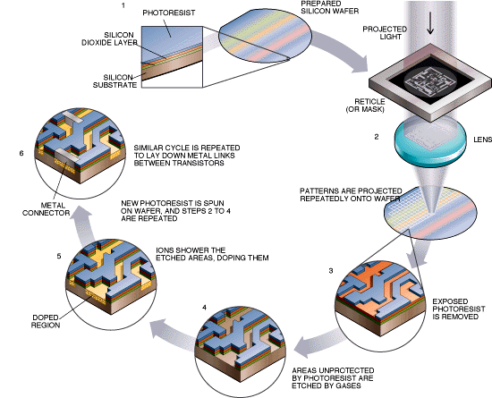

# Yield Analysis in Semiconductor Manufacturing Process
 

A complex modern semiconductor manufacturing process is normally under consistent monitoring of signals/variables collected from sensors and process measurements. However, not all of these signals are equally valuable in a specific monitoring system. The measured signals contain a combination of useful information, irrelevant information as well as noise. It is often the case that useful information is buried in the later two. Engineers typically have a much larger number of signals than are actually required. If we consider each type of signal as a feature, then feature selection may be applied to identify the most relevant signals. The Process Engineers may then use these signals to determine key factors contributing to yield excursions downstream in the process. This will enable an increase in process throughput, decreased time to learning and reduce the per unit production costs.
 

  
<dd> Figure 1. [Basic Semiconductor Manufacturing Process](http://blog.associatie.kuleuven.be/danhuayao/introduction-of-the-metallic-contamination/)

 
In this project, <b>[SECOM](http://archive.ics.uci.edu/ml/datasets/secom)</b> data-set is first screened in order to identify effective parameters on semiconductor production yield. Then, more analysis is conducted to bring more insight from the data and recommend optimization potential throughout the process. At the end, machine learning technique is used to develop a data-driven model for yield prediction at final stage of fabrication, based on operation data and sensor measurements gathered throughout the process. This notebook is organized as follows: 

# Table of Contents

<b>
1. Data-Set Description 
2. Dimension Reduction 
3. Exploratory Data Analysis (EDA) 
4. Statistical Analysis & Hypothesis Testing 
5. Time Series Analysis 
6. Imbalanced Data 
7. Machine Learning Model Development 
8. XGB Model Optimization 
9. Final Note 
</b>
