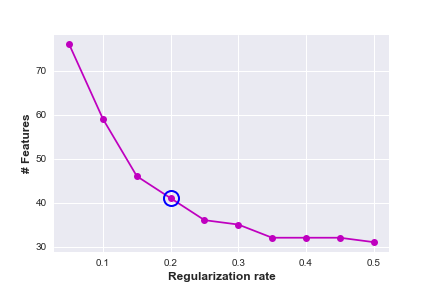
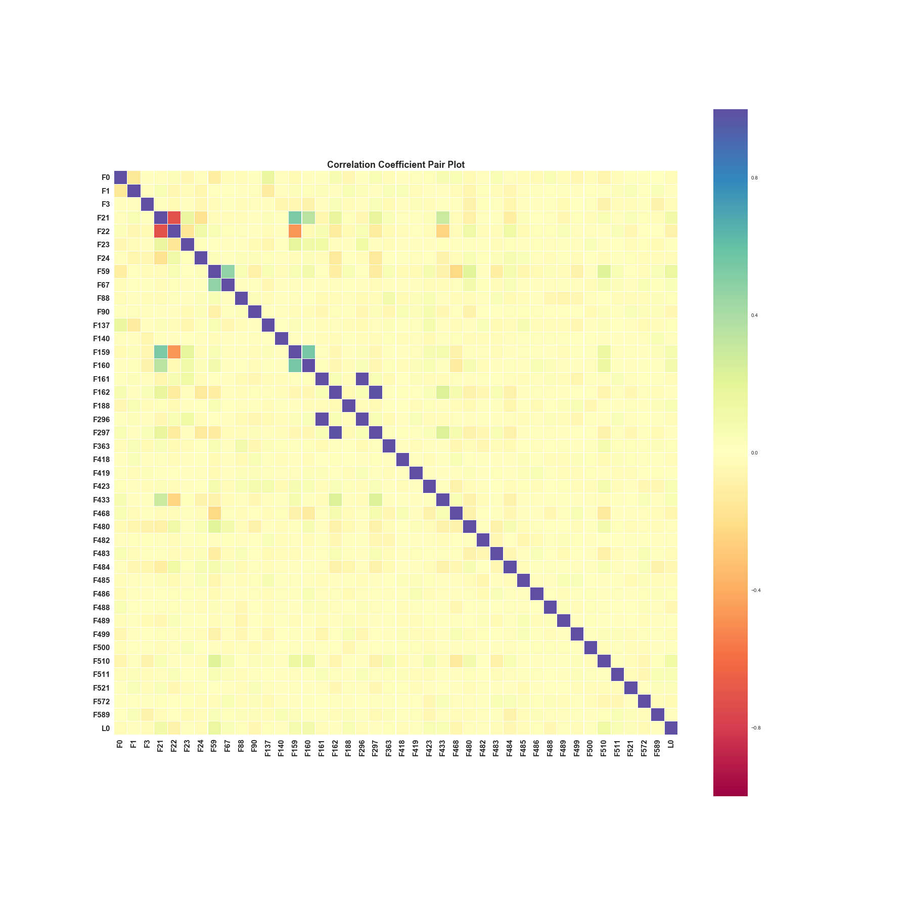
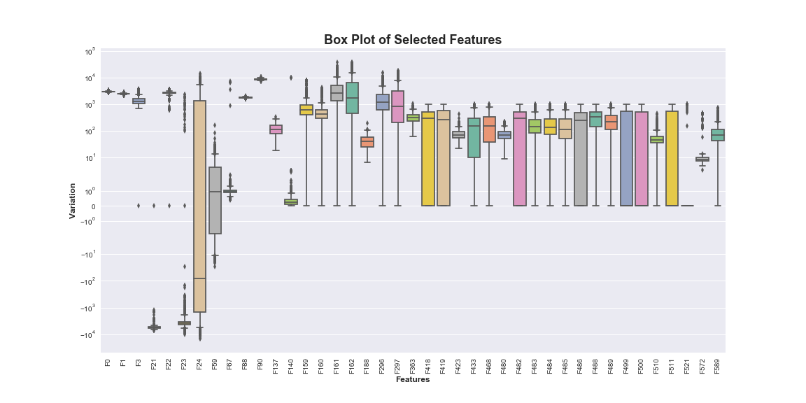
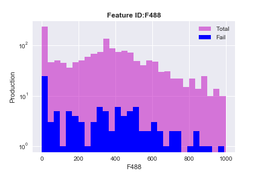
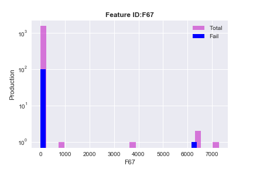
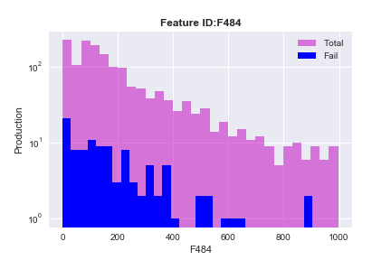
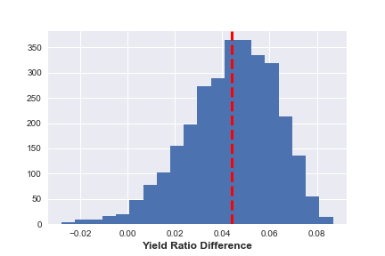
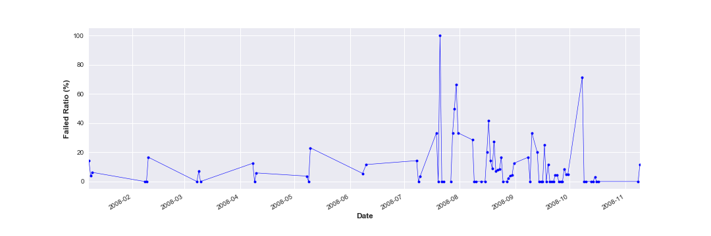
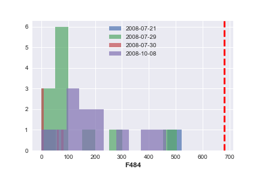

# Yield Analysis in Semiconductor Manufacturing Process
 

A complex modern semiconductor manufacturing process is normally under consistent monitoring of signals/variables collected from sensors and process measurements. However, not all of these signals are equally valuable in a specific monitoring system. The measured signals contain a combination of useful information, irrelevant information as well as noise. It is often the case that useful information is buried in the later two. Engineers typically have a much larger number of signals than are actually required. If we consider each type of signal as a feature, then feature selection may be applied to identify the most relevant signals. The Process Engineers may then use these signals to determine key factors contributing to yield excursions downstream in the process. This will enable an increase in process throughput, decreased time to learning and reduce the per unit production costs.
  

  

Figure 1. [Basic Semiconductor Manufacturing Process](http://blog.associatie.kuleuven.be/danhuayao/introduction-of-the-metallic-contamination/)

 
In this project, [SECOM](http://archive.ics.uci.edu/ml/datasets/secom/) data-set is first screened in order to identify effective parameters on semiconductor production yield. Then, more analysis is conducted to bring more insight from the data and recommend optimization potential throughout the process. At the end, machine learning technique is used to develop a data-driven model for yield prediction at final stage of fabrication, based on operation data and sensor measurements gathered throughout the process. This notebook is organized as follows: 

# Table of Contents
1. [Data-Set Description](#DSD)
2. [Dimension Reduction](#DR)
3. [Exploratory Data Analysis (EDA)](#EDA)
4. [Statistical Analysis & Hypothesis Testing](#SAHT)
5. [Time Series Analysis](#TSA)
6. [Imbalanced Data](#ID)
7. [Machine Learning Model Development](#MLMD)
8. [XGB Model Optimization](#XGBMO)
9. [Final Note](#FN)

### 1. Data-Set Description
 
The SECOM data-set comes in 2 separate files. "secom_data", which is consisting of 1567 examples each with 591 features a 1567 x 591 matrix and "secom_labels", which is containing the classification labels and date time stamp for each example.
Each example represents a single production entity with associated measured features and the labels represent a simple pass/fail yield for in house line testing and associated date time stamp. Where –1 corresponds to a pass and 1 corresponds to a fail and the data time stamp is for that specific test point. The SECOM data-set is anonymized, which results in no feature identification. In addition, all categorical data is converted to numerical value. 
 

###  2. Dimension Reduction

As mentioned earlier, there are 591 features collected for each product, but only fraction of them are really significant in yield analysis and the rest are trivial or correlated. One way to reduce the dimension of unnecessary data is to employ Lasso regularization technique. This technique identifies feature significance based on its variance. Therefore, features with smaller variances (less significant) will vanish over the course of regularization. Using this technique decreases number of features and usually considered as a first step in feature selection.   

 

 

 
Figure 2. Feature Reduction Via Lasso Regularization

  
 

In LASSO regularization technique, by tuning alpha (regularization rate) one can determine how many features to remain in the data-set. It is recommended to examine range of regularization rates to reach the optimal value. As shown above, in current case alpha = 0.2 is chosen as the optimal value, which results in drastic reduction in number of features from 591 to 41! 
 
 ###  3- Exploratory Data Analysis (EDA)

We start exploring selected features by making correlation coefficient pair plot. As shown below, there are few correlated features in remaining data-set. If our desired machine learning technique is prone to correlated data then this issue needs to be addressed before feeding data to the ML model. But more importantly, this plot shows no significant correlation between any of these features and final label column. This observation can raise concern that the collected data might not be a good descriptor of the final label. 
 

 

  

Figure 3. Correlation Coefficient Pair Plot

 

Understanding data variations and outliers is the next step in exploratory data analysis. Box plot can visually represent both concepts in a concise way. As it is evident, some of these features vary couple order of magnitudes and almost all of them suffer from outliers. These are significant issues which needs to be considered later on. Unfortunately because of the anonymity of data-set, it is very difficult to understand nature of these outliers, in order to address them accordingly. It is very important that in model selection take all these factors into account. 
 

 

  

Figure 4. Selected Features Box Plot  

 

To conduct further analysis, histogram of total and fail production for each selected feature was plotted. Quick survey of results reveals 3 different pattern in fail distribution over entire production.

* #### Category I : Uniform Distribution of Pass & Fail

 Figure 5-1. Example of Category I : Uniform Distribution of Pass & Fail

 
 

These are normal features with uniform distribution of both classes and can be used in predictive model development. 
 

* #### Category II : Non-uniform, Low Occurrence 

Figure 5-2. Example of Category II : Non-uniform, Low Occurrence

 
 

In this category, production was not uniformly distributed throughout the feature variation. The majority of operation has been carried out at particular values and only tiny fraction occurred outside that zone. These features, probably made it through the list because of the outliers not meaningful variation. In final feature selection, this category can be dropped.
 
 
* #### Category III : Non-Uniform Distribution of Pass & Fail

Figure 5-3. Example of Category III : Non-Uniform Distribution of Pass & Fail

 

This category shows non-uniform distribution of pass & fail samples. For features in this category, there are substantial range of values with relatively low failure rate. Therefore, these features are prime candidates for further process optimization. To take this to the next step, one needs first conduct hypothesis testing to figure out if these low failure rate is statistically significant and if true, incorporate more domain expertise to address the issue in real world operation. 

 

###  4- Statistical Analysis & Hypothesis Testing

Previous section showed that if some features subscribe to certain features, there might be significant difference in yield. However, visualization is not enough and it is necessary to statistically test this hypothesis. Here, F484, which has been highlighted in previous section, is examined as an example. 
 
Higher fail ratio: 0.069

Lower fail ration: 0.025

Ratio difference: 0.044

Figure 6. Hypothesis test result for 3000 replications

 
High value of P-value (0.54) indicates that the difference in yield before and after F484's threshold (dash red line) is significant. In this case, at least 54% of statistically simulated results show 63% or more decrease in failed ratio if operation can take place after designated threshold, hence this feature can be considered as an optimization point for further actions.

###  5- Time Series Analysis
Since label data-set is timestamped, it is possible to conduct time series analysis on data as well. Here, we calculate failed ratio on daily basis and the single out days with highest failed ratio (more than 50%) to examine their operation condition for F484 parameter. 

Figure 7. Daily failed ratio 

 
Figure 8 clearly illustrates that at none of these four days, F484 parameter passes 680 threshold (dash red line), recommended by hypothesis testing. Same analysis can be done for other category III parameters to bring better understanding of operation condition and its effect on yield efficiency.  

Figure 8. Feature F484 at failed ratio > 50% 

 

###  6- Imbalanced Data
The fail/total ratio indicates that imbalanced representation of binary classes with only 6 % fail class (label=1). We split the data-set to training and test set. Common practice to address imbalance data is to perform under-sampling or over-sampling on training set, which can be simply done by using imblearn library (as shown below). Due to relatively small size of the entire data-set, employing more complex under or over sampling won't be beneficiary. Despite showing both under-sampling and over-sampling here, but we are going to use original training set in Machine Learning section. Because, Extreme Gradient Boosting method inherently boosts learning from under-represented data. 

Number of passed sample: 1463

Number of failed sample: 104

Default Ratio (failed/total) : 0.066

########################################

Size of training data-set: (1096, 41)

Size of under sampling data_set: (146, 41)

Size of overer sampling data_set: (2046, 41)

###  7- Machine Learning Model Development
Due to data-set anonymity, which makes outlier removal impossible and also considering imbalanced data, which makes learning process quite difficult, we decided to choose **Extreme Gradient Boosting** Machine learning technique to develop our predictive model. This technique is not susceptible to outliers and can perfectly handle both numerical and categorical features. It also boosts learning process from hard-to-learn samples by increasing their wight factor in every iteration, which becomes handy in imbalance data-set. For model optimization we followed [AARSHAY JAIN](https://www.analyticsvidhya.com/blog/author/aarshay/) guideline. The complete article can be found at this [address](https://www.analyticsvidhya.com/blog/2016/03/complete-guide-parameter-tuning-xgboost-with-codes-python/).   
